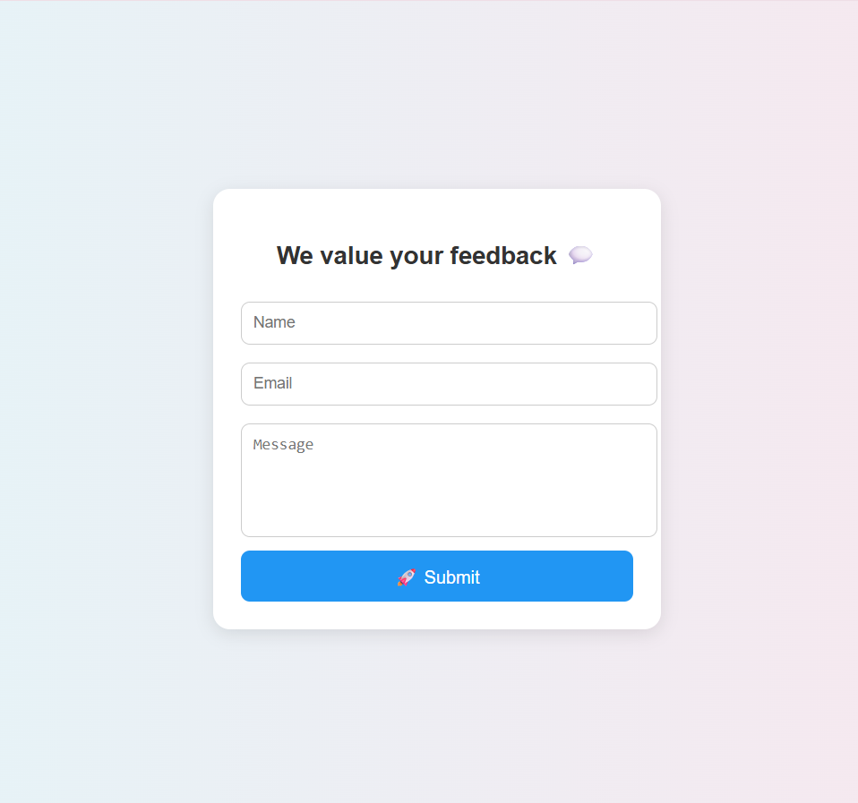

# 🌟 Feedback Form Webpage

A simple and responsive **Feedback Form** where users can share their feedback.
The submitted responses are stored and displayed with a **Thank You Message**.

## 🚀 Features

* User-friendly form with **Name, Email, and Message** fields.
* Responsive design (works on mobile & desktop).
* Data submission with **Google Apps Script** backend.
* Success message appears instantly after submission.

## 📸 UI/UX Screenshots

### 1. Feedback Form Page

### 2. Success Message Page

![Success Message] (Feedback_Success.png)

## 🔗 Live Demo

👉 [Click here to view deployed project] (https://yogitaalone04-web.github.io/Feedback-Form-Webpage/)

## 📂 Project Structure

Feedback-Form-Webpage/
│
├── frontend/
│   ├── index.html        # Main UI
│   ├── style.css         # Styling
│   ├── script.js         # Client-side logic
│   └── assets/           # Screenshots, images
│
├── backend/
│   └── backend.js        # Backend integration (Google Script / API)
│
├── docs/
│   └── UI_UX.pdf         # UI/UX Design PDF
│
└── README.md             # Documentation

## 🛠️ Tech Stack

* **HTML5, CSS3, JavaScript** (Frontend)
* **Google Apps Script** (Backend for data handling)
* **GitHub Pages / Netlify** (Deployment)

## 👩‍💻 Contributors

* Yogita Alone
* Neha (Collaborator)
